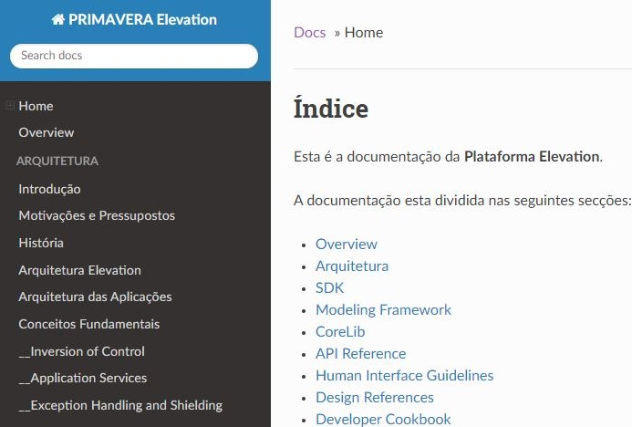
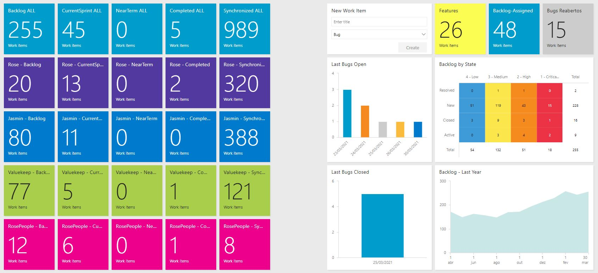
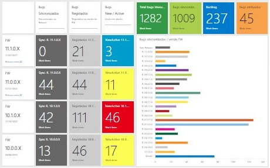

# Elevation FW Releases

Welcome to the the **Elevation Framework** house.

Here you can find the Elevation FW technical information, all the Elevation Framework Releases, Maintenance and Quality dashboards and mush more.

## Technical Documentation (elevation-docs)

  

## Release notes

  

## Maintenance Dashboard

  

## Quality Dashboard

  

## Contributing and Feedback

Contribution is limited to the INT.BIZ, INT.CORE and INT.CORE2 teams.
Any problem found in the documentation or any other suggestion should be reported to those Teams.
  

## License

This documentation is only useful for employees of PRIMAVERA BSS.
