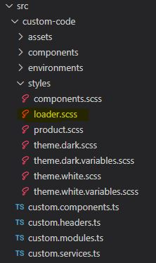
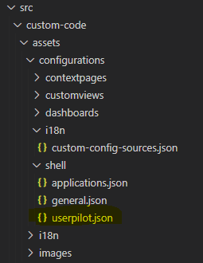

| **Server version** | 11.2.0.X                                                                   |  
| ---:               | :---                                                                       |
| **Cliente tag**    | mainline_11.2.0                                                            |
| **SDK**            | [**11.02.00.0535**](\\\storage\BUILDS\TFS\fw4\mainline\SDK\11.02.00.0535)  |
| **Upgrade DB**     | [**scripts sql**](./db_upgrade.zip)                                        |
<br/>

# Resumo das funcionalidades mais relevantes

- Possibilidade de configurar o tamanho e resolução usados no upload de imagens, incluíndo via API;
- Melhorias de performance no boot da aplicação cliente;
    - Carregamento da totalidade do menu num pedido apenas;
	- Menu guardado em cache no browser;
	- Redução de pedidos ao servidor (get e create de drafts, etc...);
	- Formly com deteção de alterações _on push_;
- Possibilidade de redifinir a animação de loading da aplicação;
- UserPilot
	- Possibilidade de definir contadores UserPilot
	- Possibilidade de definir eventos para as ações:
		- Save
		- Save and New
		- Save and Send
		- Save and Print
		- Cancel
		- Reset
		- Import
- Remoção de features obsoletas;  
- Melhorias no componente de lookup;
- Possibilidade de visualizar campos do tipo data no formato ano/mês;
- AppConfiguration: Leitura de settings usando labels hierarquicas, permitindo otimizar a gestão de settings;
<br/><br/>

# Resumo dos problemas resolvidos

- Drill down na lista com Chave e Descrição de outra Entidade _([145663](https://tfs.primaverabss.com/tfs/P.TEC.Elevation/Elevation3/_workitems?id=145663&_a=edit))_
- Lista com filtros obrigatórios fica em Loading infinito _([158404](https://tfs.primaverabss.com/tfs/P.TEC.Elevation/Elevation3/_workitems?id=158404&_a=edit))_
- Ao configurar uma lista, o campo entidade "pai" fica com os dados da entidade principal _([158406](https://tfs.primaverabss.com/tfs/P.TEC.Elevation/Elevation3/_workitems?id=158406&_a=edit))_
- Remoção de linhas de artigo não atualiza o nº de linhas na grelha de artigos _([156685](https://tfs.primaverabss.com/tfs/P.TEC.Elevation/Elevation3/_workitems?id=156685&_a=edit))_
- [FIREFOX] Templates - cursor do rato errado na checkbox de logo da empresa _([155669](https://tfs.primaverabss.com/tfs/P.TEC.Elevation/Elevation3/_workitems?id=155669&_a=edit))_
- Erro quando se insere um espaço ou + em campo lookup _([158454](https://tfs.primaverabss.com/tfs/P.TEC.Elevation/Elevation3/_workitems?id=158454&_a=edit))_
- O component inlineAlertMessage efetua duas chamadas e não resolve atributos do model na rota _([159445](https://tfs.primaverabss.com/tfs/P.TEC.Elevation/Elevation3/_workitems?id=159445&_a=edit))_
- Field do tipo Button fica disable em modo de visualização _([159406](https://tfs.primaverabss.com/tfs/P.TEC.Elevation/Elevation3/_workitems?id=159406&_a=edit))_
- Evento NewUserCreatedEvent não é disparado _([160569](https://tfs.primaverabss.com/tfs/P.TEC.Elevation/Elevation3/_workitems?id=161689&_a=edit))_
- Users convidados adicionados como application no CMS _([161715](https://tfs.primaverabss.com/tfs/P.TEC.Elevation/Elevation3/_workitems?id=161715&_a=edit))_
- Expander - Ao abrir um expander sem dados default este fica em loading _([162112](https://tfs.primaverabss.com/tfs/P.TEC.Elevation/Elevation3/_workitems?id=162112&_a=edit))_
- Support Chat - erro ao abrir _([162169](https://tfs.primaverabss.com/tfs/P.TEC.Elevation/Elevation3/_workitems?id=162169&_a=edit))_
- Lookup - Ao remover um resultado e selecionando um novo, o input é limpo temporariamente e é mostrado o icon de alerta _([162169](https://tfs.primaverabss.com/tfs/P.TEC.Elevation/Elevation3/_workitems?id=162169&_a=edit))_
- Depois de remover o valor de uma lookup e retirar foco do input, o valor apagado é mostrado novamente antes do input ser limpo _([162181](https://tfs.primaverabss.com/tfs/P.TEC.Elevation/Elevation3/_workitems?id=162181&_a=edit))_
- Imprimir e predefinir não está a guardar o template selecionado _([162212](https://tfs.primaverabss.com/tfs/P.TEC.Elevation/Elevation3/_workitems?id=162212&_a=edit))_
- Impressão em lote - o espaço que permite seleção à volta da checkbox deve ser maior _([162549](https://tfs.primaverabss.com/tfs/P.TEC.Elevation/Elevation3/_workitems?id=162549&_a=edit))_
- A criação de empresas está a navegar para a entidade (base), quando devia apontar para a extensão _([161010](https://tfs.primaverabss.com/tfs/P.TEC.Elevation/Elevation3/_workitems?id=161010&_a=edit))_
- Ao adicionar colunas no configurador de listas, são duplicadas as colunas modeladas da entidade pai _([161015](https://tfs.primaverabss.com/tfs/P.TEC.Elevation/Elevation3/_workitems?id=161015&_a=edit))_
- Na impressão o "0" do Total passa para linha de baixo _([163176](https://tfs.primaverabss.com/tfs/P.TEC.Elevation/Elevation3/_workitems?id=163176&_a=edit))_
- [MAIN OK] Background não ocupa a área do input num campo lookup em erro _([161943](https://tfs.primaverabss.com/tfs/P.TEC.Elevation/Elevation3/_workitems?id=161943&_a=edit))_
- useAplicationService com passos desnecesários _([158747](https://tfs.primaverabss.com/tfs/P.TEC.Elevation/Elevation3/_workitems?id=158747&_a=edit))_
- Não permite com editar registos que tenham uma grande quantidade de registos nas relações many-to-many _([158493](https://tfs.primaverabss.com/tfs/P.TEC.Elevation/Elevation3/_workitems?id=158493&_a=edit))_
- Correção de rotas de poupop _([161347](https://tfs.primaverabss.com/tfs/P.TEC.Elevation/Elevation3/_workitems?id=161347&_a=edit))_
- Exportação de listas para CSV desconfiguradas _([161011](https://tfs.primaverabss.com/tfs/P.TEC.Elevation/Elevation3/_workitems?id=161011&_a=edit))_
- Merge remove imagens _([159723](https://tfs.primaverabss.com/tfs/P.TEC.Elevation/Elevation3/_workitems?id=159723&_a=edit))_
- Não é possível efetuar a navegação usando um link (_[159405](https://tfs.primaverabss.com/tfs/P.TEC.Elevation/Elevation3/_workitems?id=159723&_a=edit))_

### Obsolete, As Design, Not a Bug, Duplicated ou Assumed as Limitation 
- [Assumed as Limitation] View não carrega atributo criado via api _([155479](https://tfs.primaverabss.com/tfs/P.TEC.Elevation/Elevation3/_workitems?id=155479&_a=edit))_
- [NPTR] O nome da coluna de uma lista não é traduzido se o campo não existir na lista _([159861](https://tfs.primaverabss.com/tfs/P.TEC.Elevation/Elevation3/_workitems?id=159861&_a=edit))_
- [Duplicado] Status 500 ao fazer export da lista de uma entidade custom _([163043](https://tfs.primaverabss.com/tfs/P.TEC.Elevation/Elevation3/_workitems?id=163043&_a=edit))_
- [Duplicado] Modal não carrega modelos de report _([163066](https://tfs.primaverabss.com/tfs/P.TEC.Elevation/Elevation3/_workitems?id=163066&_a=edit))_
- [Not a Bug] Resultado da pesquisa não traz entidade currency ao criar atributo tipo Money _([163071](https://tfs.primaverabss.com/tfs/P.TEC.Elevation/Elevation3/_workitems?id=163071&_a=edit))_
- [Duplicated] Validação inline altera/desformata campo _([159427](https://tfs.primaverabss.com/tfs/P.TEC.Elevation/Elevation3/_workitems?id=159427&_a=edit))_
- [NPTR] A aplicação bloqueia após o envio de um Recibo por email _([161738](https://tfs.primaverabss.com/tfs/P.TEC.Elevation/Elevation3/_workitems?id=161738&_a=edit))_
- [Obsolete] Rotas duplicadas (case sensitive) _([151338](https://tfs.primaverabss.com/tfs/P.TEC.Elevation/Elevation3/_workitems?id=151338&_a=edit))_
<br/><br/>

# Procedimentos adicionais necessários

### Alterações ao Web.Config:

Adicionar a rewrite rule:
```xml
<rule name="root"> 
    <match url="^\/?$" /> 
    <action type="Rewrite" url="ClientApp/dist/index.html" /> 
</rule> 
```
NOTA: Deve ser adicionada depois da regra _RoutesWithoutTenantAndOrganization_

Adicionar a secção:
```xml
<section name="fileUploadConfiguration" type="Primavera.Core.Domain.Configuration.FileUploadConfigurationSection, Primavera.Core, Version=3.0.0.0, Culture=neutral, PublicKeyToken=33086db60a481256" />

<fileUploadConfiguration>
    <elements>
        <add name="default" imageMaxSizeMB="3" imageSizeFormat="vga" />
    </elements>
</fileUploadConfiguration>
```

Alterar o 'type' da secção 'DataBaseUpgradeConfiguration':
```xml
<section name="databaseUpgradeConfiguration" type="Primavera.Core.Domain.Configuration.DatabaseUpgradeConfigurationSection, Primavera.Core, Version=3.0.0.0, Culture=neutral, PublicKeyToken=33086db60a481256" />
```
### Configurações da aplicação cliente

Adicionar entrada para uma rota adicional no ficheiro 'general.json'. 
```xml  
{ 
  "id": "rootFullMenuUri", 
  "baseUrl2": "/shell/menuDatas/getFullRootMenu", 
  "baseUrl": "/app/{{AccountKey}}/{{SubscriptionKey}}/shell/menuDatas/getFullRootMenu", 
  "description": "Root full menu" 
} 
```

Adicionar a seguinte entrada nos ficheiros _environment_, para ter suporte ao telemetry do lado do cliente. 
```xml
telemetry: { 
  enabled: true, 
  instrumentationKey: 'ee040cdb-a1a4-45b5-9143-acec66c68633' 
} 
```

Adicionar a seguinte entrada nos ficheiros _environment_, para que os mecanismos de cache do lado do cliente funcionam. 
```xml
caching: {
  version: "{definir version}",
  isolationKey: {definir isolationKey}"
}
```

Adicionar a dependencia _"@microsoft/applicationinsights-web": "^2.5.11"_ na ClientApp.

### Customização da animação de loading no boot da aplicação cliente

Deve ser incluído um ficheiro de estilo 'loader.scss”' juntamente com os demais ficheiros de estilo, na ClientApp:



Este ficheiro pode ser inicialmente criado vazio, e deve ser usado para fazer override ao aspeto do loader. 

### Desinstalar referências a projectos WEB de módulos de Framework

Os módulos de FW já não têm projetos WEB, pelo que podem ser desinstalados, à excepção do "Primavera.Core.Web".

### Apagar ficheiro Services.Diagram dos módulos e voltar a gerar o mesmo (auto-arrange diagram)

Este procedimento serve para fazer desaparecer o ‘Compartment’ vazio nas ListOperations (bug DSL/Microsoft)
```xml
<elementListCompartment Id="id" absoluteBounds="1, 1, 1" name="Parameters" titleTextColor="Black" itemTextColor="Black" />
``` 
NOTA: Caso não queiram perder o layout atual do diagrama de serviços, podem abrir o ficheiro Services.Diagram com o editor de texto e apagar as linhas nas ListOperations com Name="Parameters"

### Refactoring do upload de imagens  

O método _HandleImageUploadRequestAsync_ deixa de estar disponível no ApiBaseController e passa a estar disponível num o application service _ImageHandlingService_ com funcionalidades equivalentes. 
As entidades _Image_, _ImageFormatValidator_, _ImageResizer_, _Imageresizerformat_, _ImageResolutionValidator_ e _ImageSizeFormat_ foram movidas para o namespace _Primavera.Core_.
<br/><br/>

### Atualizar _UserPilot_

Deve ser incluído um ficheiro de configuração 'userpilot.json' juntamente com os demais ficheiros de configuração, na ClientApp:



Um exemplo de configuração pode ser encontrado [**aqui**](./userpilot.json).
<br/><br/>

# Packages (nuget)

Lista de dependências PRIMAVERA, para facilitar o uso do feed único:

- [**Elevation**](./packages/packages_fw.config)
- [**CoreLib**](./packages/packages_corelib.config)
- [**Lithium**](./packages/packages_lithium.config)

NOTA: Os packages CoreLib e Lithium listados, são os usados no prototipo. Devem ser entendidos como versões mínimas, podendo os produtos estar a utilizar vesões superiores por necessidades especificas de cada produto.
<br/><br/>

# Erratas e Atualizações

## HOTFIX 11.2.1 _(19 Mai 2021)_

### Foram incluídas as correções dos seguintes problemas:

- Search fields don't work with "visibleExpression" _([163867](https://tfs.primaverabss.com/tfs/P.TEC.Elevation/Elevation3/_workitems?id=163867&_a=edit))_
- Em extenções (customers e sales items) ao eliminar o registo logo após guardar é redirecionado para a lista Businesscore _([163975](https://tfs.primaverabss.com/tfs/P.TEC.Elevation/Elevation3/_workitems?id=163975&_a=edit))_
- Alternar entre listas da mesma entidade, não carrega a segunda lista _([164200](https://tfs.primaverabss.com/tfs/P.TEC.Elevation/Elevation3/_workitems?id=164200&_a=edit))_

### Procedimentos adicionais necessários

- Alterar a tag dos módulos de FW, na ClientApp, de "mainline_11.2.0" para **"hotfix_11.2.1"**
- Substituir o atual feed npm de FW "elevation" pelo novo feed **"framework"** _(o namespace mantem-se @primavera)_
- Ao alterar o tipo de resposta de uma Service Action existente para ArrayBuffer ou Blob, é necessário que no **Presentation Model** se elimine e volte a adicionar a service action onde esta é utilizada

## HOTFIX 11.2.2 _(24 Mai 2021)_

### Resumo dos problemas resolvidos

- Rotas em lower-case _([164295](https://tfs.primaverabss.com/tfs/P.TEC.Elevation/Elevation3/_workitems?id=164295&_a=edit))_
- Filtro de listas de entidade company dependent apresenta entidades da empresa errada _([164359](https://tfs.primaverabss.com/tfs/P.TEC.Elevation/Elevation3/_workitems?id=164359&_a=edit))_
- Clear e contador na impressão em lote não está visible _([164393](https://tfs.primaverabss.com/tfs/P.TEC.Elevation/Elevation3/_workitems?id=164393&_a=edit))_
- Ao correr uma tarefa que use um background worker o contexto é perdido (geração SAFT) _([164462](https://tfs.primaverabss.com/tfs/P.TEC.Elevation/Elevation3/_workitems?id=164462&_a=edit))_
- Model do lado de cliente não é atualizado _([164555](https://tfs.primaverabss.com/tfs/P.TEC.Elevation/Elevation3/_workitems?id=164555&_a=edit))_
- Na edição de tipo de documento a grelha fica com colunas a mais _([164449](https://tfs.primaverabss.com/tfs/P.TEC.Elevation/Elevation3/_workitems?id=164449&_a=edit))_
- Ações dos dashboards não estão a funcionar _([164495](https://tfs.primaverabss.com/tfs/P.TEC.Elevation/Elevation3/_workitems?id=164495&_a=edit))_
- Quando ocorre um erro a view fica sempre em loading _([164333](https://tfs.primaverabss.com/tfs/P.TEC.Elevation/Elevation3/_workitems?id=164333&_a=edit))_
- StaticContent: env.js é pedido sem account e subscription _([164731](https://tfs.primaverabss.com/tfs/P.TEC.Elevation/Elevation3/_workitems?id=164731&_a=edit))_
- Quando o token expira a aplicação deixa de responder _([164364](https://tfs.primaverabss.com/tfs/P.TEC.Elevation/Elevation3/_workitems?id=164364&_a=edit))_

### Procedimentos adicionais necessários

- Alterar a tag dos módulos de FW, na ClientApp, de "hotfix_11.2.1" para **"hotfix_11.2.2"**
- Promover os seguintes packages para o feed de produto:
  - [**Elevation**](./packages/packages_fw_hotfix_11_2_2.config)

## HOTFIX 11.2.3 _(25 Mai 2021)_

### Resumo dos problemas resolvidos

- Many-to-many: Erro ao editar com uma grande quantidade de registos nas relações _([158493](https://tfs.primaverabss.com/tfs/P.TEC.Elevation/Elevation3/_workitems?id=158493&_a=edit))_
- Ao alterar as "visible rows" elemina linhas em edição _([164705](https://tfs.primaverabss.com/tfs/P.TEC.Elevation/Elevation3/_workitems?id=164705&_a=edit))_
- Estilos das grelhas no produto errados _([162351](https://tfs.primaverabss.com/tfs/P.TEC.Elevation/Elevation3/_workitems?id=162351&_a=edit))_
- Custom drill down com rota duplicada _([164718](https://tfs.primaverabss.com/tfs/P.TEC.Elevation/Elevation3/_workitems?id=164718&_a=edit))_
- Context Actions com responseType diferente de json falham em views com com campos de utilizador _([164857](https://tfs.primaverabss.com/tfs/P.TEC.Elevation/Elevation3/_workitems?id=164857&_a=edit))_
- Erro a exportar ficheiros a partir do componente InlineAlertMessage _([164893](https://tfs.primaverabss.com/tfs/P.TEC.Elevation/Elevation3/_workitems?id=164893&_a=edit))_

### Procedimentos adicionais necessários

- Alterar a tag dos módulos de FW, na ClientApp, de "hotfix_11.2.2" para **"hotfix_11.2.3"**
- Atualizar o SDK: "\\\storage\BUILDS\TFS\framework\hotfix-11.2\sdk\\**11.2.3.0004**"
- Promover os seguintes packages para o feed de produto:
  - [**Elevation**](./packages/packages_fw_hotfix_11_2_3.config)

## HOTFIX 11.2.4 _(28 Mai 2021)_

### Resumo dos problemas resolvidos

- Product Warnings não são mostrados na barra superior _([164895](https://tfs.primaverabss.com/tfs/P.TEC.Elevation/Elevation3/_workitems?id=164895&_a=edit))_ 
- Tipos de documento - é necessário fazer alguma alteração na linha para que o campo tipo de comunicação esteja desbloqueado _([164784](https://tfs.primaverabss.com/tfs/P.TEC.Elevation/Elevation3/_workitems?id=164784&_a=edit))_

### Procedimentos adicionais necessários

- Promover os seguintes packages para o feed de produto:
  - [**Elevation**](./packages/packages_fw_hotfix_11_2_4.config)
  - [**Lithium**](./packages/packages_lithium_hotfix_11_2_4.config)
- Alterar a tag dos módulos de FW, na ClientApp, de "hotfix_11.2.3" para **"hotfix_11.2.4"**

## HOTFIX 11.2.5 _(2 Jun 2021)_

### Resumo dos problemas resolvidos

- Campos desbloqueados depois de gravar entidade enquanto view está em loading _([165168](https://tfs.primaverabss.com/tfs/P.TEC.Elevation/Elevation3/_workitems?id=165168&_a=edit))_ 
- Querie OData não funciona sem definir 'Select' em entidades com FK para entidades com Entity Thumbnail _([163870](https://tfs.primaverabss.com/tfs/P.TEC.Elevation/Elevation3/_workitems?id=163870&_a=edit))_ 
- Erro a exportar ficheiros a partir do componente InlineAlertMessage _([164893](https://tfs.primaverabss.com/tfs/P.TEC.Elevation/Elevation3/_workitems?id=164893&_a=edit))_ 

### Procedimentos adicionais necessários

- Alterar a tag dos módulos de FW, na ClientApp, de "hotfix_11.2.4" para **"hotfix_11.2.5"**
- Atualizar o SDK: "\\\storage\BUILDS\TFS\framework\hotfix-11.2\sdk\\**11.2.5.0005**"
- Promover os seguintes packages para o feed de produto:
  - [**Elevation**](./packages/packages_fw_hotfix_11_2_5.config)
  <br/>_**Nota:** Como a funcionalidade de 'import' para o 'global feed' no portal DevOps não está a funcionar, podem, excecionalmente, encontrar estes packages no feed **private-elevation-fw**_

## HOTFIX 11.2.6 _(7 Jun 2021)_

### Resumo dos problemas resolvidos

- Erro ao entrar na view de criação de entidade a que use uma sequência em que uma das partes depende de outra entidade B _([165551](https://tfs.primaverabss.com/tfs/P.TEC.Elevation/Elevation3/_workitems?id=165551&_a=edit))_ 
- Erro ao abrir anexos do tipo PDF no método FW attachment _([165706](https://tfs.primaverabss.com/tfs/P.TEC.Elevation/Elevation3/_workitems?id=165706&_a=edit))_ 
- Importação de ficheiros: view não é atualizada ao fazer importações _([164883](https://tfs.primaverabss.com/tfs/P.TEC.Elevation/Elevation3/_workitems?id=164883&_a=edit))_ 
- Picking que navega para ele próprio não atualiza _([166569](https://tfs.primaverabss.com/tfs/P.TEC.Elevation/Elevation3/_workitems?id=166569&_a=edit))_ 
- Import files - "IMPORT" fica sempre disable na importação de um segundo ficheiro _([166820](https://tfs.primaverabss.com/tfs/P.TEC.Elevation/Elevation3/_workitems?id=166820&_a=edit))_ 

### Procedimentos adicionais necessários

- Alterar a tag dos módulos de FW, na ClientApp, de "hotfix_11.2.5" para **"hotfix_11.2.6"**
- Atualizar o SDK: "\\\storage\BUILDS\TFS\framework\hotfix-11.2\sdk\\**11.2.6.0006**"  

## HOTFIX 11.2.7 _(30 Jun 2021)_

### Resumo dos problemas resolvidos

- Custom attribute não é mostrado na extensão _([167622](https://tfs.primaverabss.com/tfs/P.TEC.Elevation/Elevation3/_workitems?id=167622&_a=edit))_ 
- Import Files - ficheiro inválido ao efetuar download do template _([167623](https://tfs.primaverabss.com/tfs/P.TEC.Elevation/Elevation3/_workitems?id=167623&_a=edit))_ 
- UserPilot não regista informação quando não existem counters definidos _([167562](https://tfs.primaverabss.com/tfs/P.TEC.Elevation/Elevation3/_workitems?id=167562&_a=edit))_ 
- Extensibilidade - Erro ao adicionar coluna de tabela personalizada a partir de outra do mesmo tipo _([167784](https://tfs.primaverabss.com/tfs/P.TEC.Elevation/Elevation3/_workitems?id=167784&_a=edit))_ 

### Procedimentos adicionais necessários

- Atualizar o SDK: "\\\storage\BUILDS\TFS\framework\hotfix-11.2\sdk\\**11.2.7.0007**" 
- Alterar a tag dos módulos de FW, na ClientApp, de "hotfix_11.2.6" para **"hotfix_11.2.7"**
- Promover os seguintes packages para o feed de produto:
  - [**Elevation**](./packages/packages_fw_hotfix_11_2_7.config)

## HOTFIX 11.2.8 _(5 Jul 2021)_

### Resumo dos problemas resolvidos

- AdditionalItems não estão a ser mapeados _([167985](https://tfs.primaverabss.com/tfs/P.TEC.Elevation/Elevation3/_workitems?id=167985&_a=edit))_ 
- Impressão em lote não imprime os documentos que ainda não tenha sido impresso _([167555](https://tfs.primaverabss.com/tfs/P.TEC.Elevation/Elevation3/_workitems?id=167555&_a=edit))_

### Procedimentos adicionais necessários

- Promover os seguintes packages para o feed de produto:
  - [**Elevation**](./packages/packages_fw_hotfix_11_2_8.config)
  - [**Lithium**](./packages/packages_lithium_hotfix_11_2_8.config)

## HOTFIX 11.2.9 _(8 Jul 2021)_

### Resumo dos problemas resolvidos

- Erro ao exportar listas para csv quando nome contém carateres especiais _([167741](https://tfs.primaverabss.com/tfs/P.TEC.Elevation/Elevation3/_workitems?id=167741&_a=edit))_ 
- FIREFOX: Picagem de artigos com o leitor de código de barras introduz artigo errado _([168125](https://tfs.primaverabss.com/tfs/P.TEC.Elevation/Elevation3/_workitems?id=168125&_a=edit))_

### Procedimentos adicionais necessários

- Alterar a tag dos módulos de FW, na ClientApp, de "hotfix_11.2.7" para "**hotfix_11.2.9**"
- Promover os seguintes packages para o feed de produto:
  - [**Elevation**](./packages/packages_fw_hotfix_11_2_9.config)
