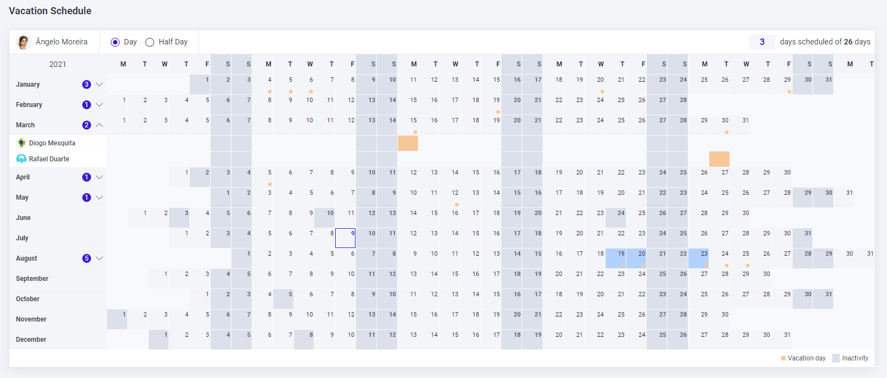
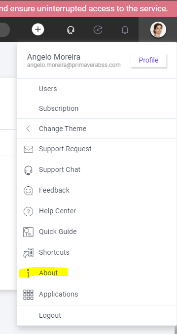
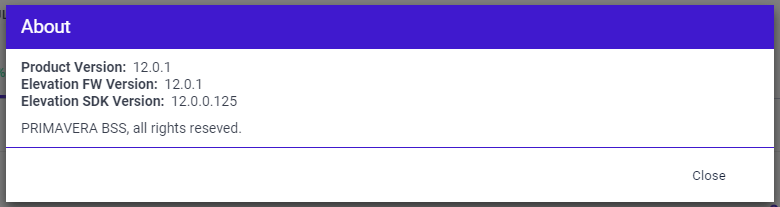
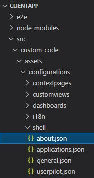
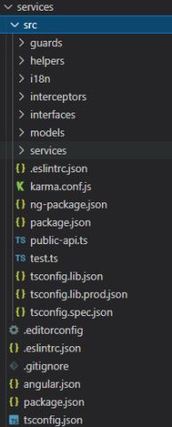

| **Server version** | 12.0.1.X                                                                           |  
| ---:               | :---                                                                               |
| **Cliente tag**    | release_12.0.1                                                                     |
| **SDK**            | [**12.00.01.0003**](\\\storage\BUILDS\TFS\framework\release-12.0\sdk\12.0.1.0003)  |
<br/>

# Resumo das funcionalidades mais relevantes

- Atualização tecnológica: Angular 11
- Performance:
  - Reformulação do boot da aplicação servidor
  - Utilização de LazyLoading para carregamento dos módulos (Framework module vs Product Module) na aplicação cliente
  - Melhorias generalizadas na utilização da aplicação (client-side)
  - Pesquisa nas listas
  - Gestão de imagens para impressão
- Melhorias na forma como se faz debug da aplicação cliente
- Reformulação das rotas cliente
- Reformulação do versionamento da aplicação cliente e gestão de conteúdos estáticos
- Disponibilização de um novo componente client-side de calendário (vista anual)
  <br/>
  
- Possibilidade de incluir no 'user menu' uma entrada com informação sobre o produto:
  <br/>
  
  <br/>
  
- Possibilidade de definir um 'response type' na modelação de service actions:
  - json
  - blob
  - array buffer
- Upgrade Database:
  - Possibilidade de definir dependencias no processo de atualização de base de dados
<br/><br/>

# Resumo dos problemas resolvidos

- AdditionalItems não estão a ser mapeados _([167985](https://tfs.primaverabss.com/tfs/P.TEC.Elevation/Elevation3/_workitems?id=167985&_a=edit))_
- Correção de rotas de poupop _([161347](https://tfs.primaverabss.com/tfs/P.TEC.Elevation/Elevation3/_workitems?id=161347&_a=edit))_
- Print de documentos - datas na impressão não respeitam a cultura _([146553](https://tfs.primaverabss.com/tfs/P.TEC.Elevation/Elevation3/_workitems?id=146553&_a=edit))_
- Sempre que não existem valores a somar ou o somatório total é 0€ aparece a label "Soma: " _([147841](https://tfs.primaverabss.com/tfs/P.TEC.Elevation/Elevation3/_workitems?id=147841&_a=edit))_
- Picagem de artigos com o leitor de código de barras introduz artigo errado _([168125](https://tfs.primaverabss.com/tfs/P.TEC.Elevation/Elevation3/_workitems?id=168125&_a=edit))_
- Status 500 ao inserir registo para uma entidade custom _([168111](https://tfs.primaverabss.com/tfs/P.TEC.Elevation/Elevation3/_workitems?id=168111&_a=edit))_
- No update de BD a imagem de update fica desformatada _([168072](https://tfs.primaverabss.com/tfs/P.TEC.Elevation/Elevation3/_workitems?id=168072&_a=edit))_
- WildCards só assume o dia às 01:00:00 _([167977](https://tfs.primaverabss.com/tfs/P.TEC.Elevation/Elevation3/_workitems?id=167977&_a=edit))_
- Atributo custom tipo enumerable, não renderiza os dados na grelha _([167786](https://tfs.primaverabss.com/tfs/P.TEC.Elevation/Elevation3/_workitems?id=167786&_a=edit))_
- Erro ao exportar listas para csv quando nome contém carateres especiais _([167741](https://tfs.primaverabss.com/tfs/P.TEC.Elevation/Elevation3/_workitems?id=167741&_a=edit))_
- Import Files - ficheiro inválido ao efetuar download do template. _([167623](https://tfs.primaverabss.com/tfs/P.TEC.Elevation/Elevation3/_workitems?id=167623&_a=edit))_
- Impressão em lote não imprime os documentos que ainda não tenha sido impressos _([167555](https://tfs.primaverabss.com/tfs/P.TEC.Elevation/Elevation3/_workitems?id=167555&_a=edit))_
- Falha de CSS em components _([167110](https://tfs.primaverabss.com/tfs/P.TEC.Elevation/Elevation3/_workitems?id=167110&_a=edit))_
- Não é possivel editar o default value path _([167108](https://tfs.primaverabss.com/tfs/P.TEC.Elevation/Elevation3/_workitems?id=167108&_a=edit))_
- Falha no componente de pesquisa _([167107](https://tfs.primaverabss.com/tfs/P.TEC.Elevation/Elevation3/_workitems?id=167107&_a=edit))_
- ExceptionMessage deixou de funcionar _([165064](https://tfs.primaverabss.com/tfs/P.TEC.Elevation/Elevation3/_workitems?id=165064&_a=edit))_
- No painel de contexto das notificações push, quando é 1 minuto, deve aparecer no singular _([164496](https://tfs.primaverabss.com/tfs/P.TEC.Elevation/Elevation3/_workitems?id=164496&_a=edit))_
- Não renderiza imagens após upload _([163366](https://tfs.primaverabss.com/tfs/P.TEC.Elevation/Elevation3/_workitems?id=163366&_a=edit))_
- Na lista de Unidades, o drilldown da dimensão está errado _([162697](https://tfs.primaverabss.com/tfs/P.TEC.Elevation/Elevation3/_workitems?id=162697&_a=edit))_
- Background não ocupa a área do input num campo lookup em erro _([161943](https://tfs.primaverabss.com/tfs/P.TEC.Elevation/Elevation3/_workitems?id=161943&_a=edit))_
- Mapas de exploração em modo dark não mostra os valores perceptíveis (colunas) _([160623](https://tfs.primaverabss.com/tfs/P.TEC.Elevation/Elevation3/_workitems?id=160623&_a=edit))_
- Não é possível definir o valor da variavel kendo-grid-accent _([160077](https://tfs.primaverabss.com/tfs/P.TEC.Elevation/Elevation3/_workitems?id=160077&_a=edit))_
- Lista não carrega o valor do atributo personalizado tipo money _([149987](https://tfs.primaverabss.com/tfs/P.TEC.Elevation/Elevation3/_workitems?id=149987&_a=edit))_
- Lookup - no componente de utilizador nas tasks é apresentada uma linha em branco _([167149](https://tfs.primaverabss.com/tfs/P.TEC.Elevation/Elevation3/_workitems?id=167149&_a=edit))_
- Clicando nos links do dashboard, faz reload à app _([166931](https://tfs.primaverabss.com/tfs/P.TEC.Elevation/Elevation3/_workitems?id=166931&_a=edit))_
- Campos selecionados de picking não são limpos ao filtrar novos dados _([166678](https://tfs.primaverabss.com/tfs/P.TEC.Elevation/Elevation3/_workitems?id=166678&_a=edit))_
- Os webcomponents não estão a reagir direito em visualização _([166532](https://tfs.primaverabss.com/tfs/P.TEC.Elevation/Elevation3/_workitems?id=166532&_a=edit))_
- Erro na consola quando não existem quick actions _([164274](https://tfs.primaverabss.com/tfs/P.TEC.Elevation/Elevation3/_workitems?id=164274&_a=edit))_
- Quando a chave é apenas um caratere não aparece no ecrã de edição _([149586](https://tfs.primaverabss.com/tfs/P.TEC.Elevation/Elevation3/_workitems?id=149586&_a=edit))_
- Botão de Quick actions fica com aspeto de clicável mesmo quando não há quick actions definidas _([146291](https://tfs.primaverabss.com/tfs/P.TEC.Elevation/Elevation3/_workitems?id=146291&_a=edit))_
- BD partilhada - Upgrade BD não corre scripts de upgrade _([168470](https://tfs.primaverabss.com/tfs/P.TEC.Elevation/Elevation3/_workitems?id=168470&_a=edit))_
- BD partilhada - Upgrade de BD com script com erro não mostra mensagem clara ao utilizador _([168518](https://tfs.primaverabss.com/tfs/P.TEC.Elevation/Elevation3/_workitems?id=168518&_a=edit))_
- BD partilhada - Upgrade de bd apesar de falhar, dá sucesso (200 - true) via postman _([168536](https://tfs.primaverabss.com/tfs/P.TEC.Elevation/Elevation3/_workitems?id=168536&_a=edit))_
- BD partilhada - Erro ao executar upgrade de BD com dependência na Core _([168551](https://tfs.primaverabss.com/tfs/P.TEC.Elevation/Elevation3/_workitems?id=168551&_a=edit))_
- BD partilhada - Erro ao executar upgrade de BD com dependência na Core quando a outra subscrição está down _([168889](https://tfs.primaverabss.com/tfs/P.TEC.Elevation/Elevation3/_workitems?id=168889&_a=edit))_
- BD partilhada - É executa upgrade de BD com dependência para a CORE mesmo se existem dependencias na versão inferior _([168937](https://tfs.primaverabss.com/tfs/P.TEC.Elevation/Elevation3/_workitems?id=168937&_a=edit))_
- BD partilhada - Não executa upgrade de BD com dependência para a ELEVATION _([168931](https://tfs.primaverabss.com/tfs/P.TEC.Elevation/Elevation3/_workitems?id=168931&_a=edit))_
- Na popup o Email é enviado apesar de um dos destinatários ter email inválido, quando emails separados por espaço _([169110](https://tfs.primaverabss.com/tfs/P.TEC.Elevation/Elevation3/_workitems?id=169110&_a=edit))_
- Campos em erro são limpos ao mudar de linha na grelha _([150002](https://tfs.primaverabss.com/tfs/P.TEC.Elevation/Elevation3/_workitems?id=150002&_a=edit))_
- Erro ao fazer SaveAndNew com ReturnNavigationAction _([168985](https://tfs.primaverabss.com/tfs/P.TEC.Elevation/Elevation3/_workitems?id=168985&_a=edit))_

### Obsolete, As Design, Not a Bug, Duplicated ou Assumed as Limitation 

- Landingpage - Link de download não funciona _([168099](https://tfs.primaverabss.com/tfs/P.TEC.Elevation/Elevation3/_workitems?id=168099&_a=edit))_
- Modal custom attribute não é renderizado _([167844](https://tfs.primaverabss.com/tfs/P.TEC.Elevation/Elevation3/_workitems?id=167844&_a=edit))_
- Service action - não é possível adicionar _([166527](https://tfs.primaverabss.com/tfs/P.TEC.Elevation/Elevation3/_workitems?id=166527&_a=edit))_
- Adicionar um filtro a uma list operation custom source _([165731](https://tfs.primaverabss.com/tfs/P.TEC.Elevation/Elevation3/_workitems?id=165731&_a=edit))_
- Lista de documentos não aparece na grelha no modal ao importar SAFT vendas _([165390](https://tfs.primaverabss.com/tfs/P.TEC.Elevation/Elevation3/_workitems?id=165390&_a=edit))_
- Icone a alertar o utilizador fica desformatado na criação de contas da contabilidade _([161733](https://tfs.primaverabss.com/tfs/P.TEC.Elevation/Elevation3/_workitems?id=161733&_a=edit))_
- Erro na utilização de custom web components em grids _([126061](https://tfs.primaverabss.com/tfs/P.TEC.Elevation/Elevation3/_workitems?id=126061&_a=edit))_
<br/><br/>

# Procedimentos adicionais necessários

### Informação de versão de produto
Para ativar a opção do user menu que permite consultar a versão do produto:
 - Adicionar o ficheiro about.json na ClientApp:
 
  
  Exemplo de ficheiro [**aqui**](./about.json).
 - No 'environment.json' habilitar a funcionalidade:
```xml
{
  ...
  "showAboutOption": true,
  ...
}
```

### Dependências na atualização de BDs:

- Alterar o web.config, reformulando a secção 'databaseUpgradeConfiguration' de acordo com a nova estrutura representada no exemplo:
```xml
<databaseUpgradeConfiguration>
    <elements>
      <add name="default" databaseUpgradeCommandTimeout="600"  clientId="(Este cliente deve ter permissões sobre as subscrições dos vários produtos dependentes)" clientSecret="XXX" webApiScopes="(todas as scopes necessárias para interagir com os produtos dependentes)">
        <dependencies>        
          
          <add name="CORE" version="1.00.0000.0001">
            <fileStorageConfiguration name="default" type="Primavera.Core.Storage.Azure.Files.AzureFileStorageService, Primavera.CoreLib.Storage.Azure, Version=4.0.0.0, Culture=neutral, PublicKeyToken=33086db60a481256">
              <settings>
                <add key="StorageConnectionString" value="XXX (Blob com a localização das scripts)" />
                <add key="ServerConnectionTimeout" value="00:00:15" />
                <add key="RequireEncryption" value="false" />
                <add key="MaximumExecutionTime" value="00:02:00" />
                <add key="RetryPolicy" value="Linear" />
                <add key="RetryPolicyMaximumAttempts" value="4" />
                <add key="RetryPolicyBackoffTime" value="00:00:03" />
              </settings>
            </fileStorageConfiguration>
            <markets>
              <add key="market_pt" value="pt" />
              <add key="market_es" value="es" />
              <add key="market_en" value="en" />
            </markets>
          </add>
          
          <add name="ELEVATION" version="2.00.0000.0001">
            <fileStorageConfiguration name="default" type="Primavera.Core.Storage.Files.LocalFileStorageService, Primavera.CoreLib, Version=4.0.0.0, Culture=neutral, PublicKeyToken=33086db60a481256">
              <settings>
                <add key="StorageConnectionString" value="XXX (Blob com a localização das scripts)" />
                <add key="ServerConnectionTimeout" value="00:00:15" />
                <add key="RequireEncryption" value="false" />
                <add key="MaximumExecutionTime" value="00:02:00" />
                <add key="RetryPolicy" value="Linear" />
                <add key="RetryPolicyMaximumAttempts" value="4" />
                <add key="RetryPolicyBackoffTime" value="00:00:03" />
              </settings>
            </fileStorageConfiguration>
            <markets>
              <add key="market_pt" value="App_Data\upgrade\pt" />
              <add key="market_es" value="App_Data\upgrade\es" />
              <add key="market_en" value="App_Data\upgrade\en" />
            </markets>
          </add>
          
        </dependencies>
      </add>
    </elements>
  </databaseUpgradeConfiguration>
```
  - Declarar as dependencias pela ordem que devem ser executadas.
  - O último 'add' é sempre referente ao próprio produto e a propriedade name deve ser configurada com o 'productAlias'.
    - Quando não há dependências é a única entrada que deve ser declarada.
- Remover a propriedade 'databaseVersionValidation'.
- Adicionar uma feature chamada "ProductUrl" em todas as AppInstancies com o valor da url base do produto (ex: https://app-rose.primaverabs.com)

NOTA: Para cada dependencia declarada, existe também uma entrada na tabela Operations.DBVersions representando o versionamento atual de uma determinada subscrição (AppInstance)

### Aplicação da correção do Bug #156275
É necessário forçar a geração de um novo ID para as listas em erro. Para que isto aconteça:
  - Abrir o Presentation Model;
  - Alterar a propriedade Allow User Customization da List View respetiva para um valor diferente do original e depois para o original novamente;
  - Gravar o modelo;
  - Fazer checkin do módulo. 
Quando a alteração chegar ao produto já será possível adicionar/remover permissão para a operação anteriormente em erro. 
Não esquecer que deve ser dada novamente permissão na role principal/root para ela aparecer nas restantes roles.

### Conversão módulos angular para a versão 11

Na eventualidade de existirem módulos angular custom nos produtos numa versão anterior À 8, devem ser 
executados os seguintes passos:

1. Instalar a versão “current” do NodeJs e garantir que é a versão de trabalho na linha de 
comandos (executar node –version e garantir que a versão é a 16 ou superior.)

	Estrutura “exemplo” para um módulo após a migração:
	<br/>
	

2. Executar npm install
4. Remover read-only de todos os ficheiros na pasta do modulo
5. No package.json remover (se existir) "@angular/http": "^7.2.15"6. 
6. Avaliar os passos/pontos de migração existentes no guia de migração do [**angular**] (https://update.angular.io/?l=2&v=8.0-11.0) em conjunto com as seguintes instruções:
	  - ng update
	  - ng update @angular/core@8 @angular/cli@8
	  - ng update @angular/core@9 @angular/cli@9
	  - Pesquisar por ModuleWithProviders e colocar ModuleWithProviders<Nome do módulo>
	  - Colocar dependências primavera a apontar para as novas builds(v11) 
	  - ng update @angular/core@10 @angular/cli@10
	  - ng update @angular/core @angular/cli
	  - Tendo por base o trabalho de migração já realizado nos módulos da FW e tendo por base um desses mesmos módulos deve-se replicar as configurações para os seguintes ficheiros
	    - Atualizar o ficheiro angular.json
	    - Criar ./src/tsconfig.lib.ts
	    - Criar ./src/tsconfig.lib.prod.ts
	    - Renomear ./src/index.ts para ./src/public-api.ts
	    - Criar ficheiro ./src/ng-package.json
	    - Colocar no packages.json como devDep "ng-packagr": "^11.0.0",
	    - Copiar de um dos módulos da FW os scripts de execução npm. 
6. Remover a pasta node_modules e o ficheiro “package.lock.json”
7. Verificar as dependências no ficheiro packages.json e avaliar a existência de dependências “deprecated” (moment.js, lodash, gulp, outras..) e realizar a atualização dependências para as versões mais recentes. Isto irá implicar correções ao código.
8. Remover dead files (ficheiros que deixaram de fazer sentido após a migração)
9. Executar npm i (sem o switch “—force”)
10. Executar npm build
  - Neste passo é normal surgirem erros que devem ser corrigidos um a um até não existir qualquer erro.

Nota: Deve ter-se em conta que estes passos são algo genéricos e dependendo das especificidades do módulo em questão podem ser necessários passos adicionais ou alternativos

### Registo de Application Services e Providers
	
- Eliminar anotações obsoletas (ApplicationService e ApplicationServiceImplemention) dos contratos e respetivas implementações dos Application Services custom;	
- Eliminar anotações obsoletas (ApplicationServiceProvider e ApplicationServiceProviderImplemention) dos contratos e respetivas implementações dos Application Service Providers custom;
- Convergir todos os custom Application Services e Application Service Providers para o projeto Domain dos módulos em questão;
- Criar classe parcial da classe correspondente ao Module Bootstrapper do módulo (ex: SalesModuleBootstrapper), de modo a registar os serviços custom através do ServiceRegistry (override método Register);
- Em caso de utilização de filtros na implementação de um Application Service (ApplicationService(Filters=…)) deverá ser efetuado um refactor para que o filtro seja aplicado aquando da resolução do serviço(s); Esta funcionalidade deixou de ser suportada.

### Performance da pesquisa nas listas

- Efetuar o Drop das TVF’s de sistema utilizadas nas listas das entidades (ex: Sales.OrdersQuery) e recriá-las recorrendo aos scripts SQL gerados
- Caso existam TVF’s de utilizador, a estratégia de migração deverá ser definida pela equipa de produto.

### Refactoring do boot da aplicação servidor

- Eliminar os ficheiros “Global.tt”, “Global.asax”, “Global.asax.tt” e “Global.asax.cs”, caso existam no projeto Host do produto.

### Publicação de ClientApp em Static Web Site independente

- Não existe nenhum procedimento adicional que tenha que ser feito pela equipa, contudo, esta separação, implica alinhamento com SWE e CMS, estando dependente da disponibilidade destas equipas.

# Packages (nuget)

Lista de dependências PRIMAVERA, para facilitar o uso do feed único:

- [**Elevation**](./packages/packages_fw_12_0_1.config)
- [**CoreLib**](./packages/packages_corelib_12_0_1.config)
- [**Lithium**](./packages/packages_lithium_12_0_1.config)
- [**ThirdParty**](./packages/packages_thirdparty_12_0_1.config) _(outros packages que devem ser atualizados)_
<br/><br/>

# Erratas e Atualizações

## HOTFIX 12.0.3 _(9 Ago 2021)_

### Resumo dos problemas resolvidos

- Drilldown em popup - erro ao fazer drilldown dentro dum create inline _([169851](https://tfs.primaverabss.com/tfs/P.TEC.Elevation/Elevation3/_workitems?id=169851&_a=edit))_
- Refresh dos totais nos extratos não é atualizado quando aplicados filtros _([169784](https://tfs.primaverabss.com/tfs/P.TEC.Elevation/Elevation3/_workitems?id=169784&_a=edit))_
- Erro de draft ao aceder ao create de uma entidade company dependent _([170522](https://tfs.primaverabss.com/tfs/P.TEC.Elevation/Elevation3/_workitems?id=170522&_a=edit))_
- Num detail criar um registo que não respeita a regra de lookup e introduzir _([141977](https://tfs.primaverabss.com/tfs/P.TEC.Elevation/Elevation3/_workitems?id=141977&_a=edit))_
- Create inline - popup não abre quando é feito create inline dentro de outro create inline _([168805](https://tfs.primaverabss.com/tfs/P.TEC.Elevation/Elevation3/_workitems?id=168805&_a=edit))_
- Erro na geração de Código do controller API base _([169535](https://tfs.primaverabss.com/tfs/P.TEC.Elevation/Elevation3/_workitems?id=169535&_a=edit))_
- Refresh dos totais nos extratos não é atualizado quando aplicados filtros _([169784](https://tfs.primaverabss.com/tfs/P.TEC.Elevation/Elevation3/_workitems?id=169784&_a=edit))_
- Database dependencies - ProductAlias está a ser usado no GetDependencies e a feature Route deveria ser usada _([170658](https://tfs.primaverabss.com/tfs/P.TEC.Elevation/Elevation3/_workitems?id=170658&_a=edit))_
- Quando um convite expira, não é possível convidar novamente porque o user já existe na BD do produto _([170461](https://tfs.primaverabss.com/tfs/P.TEC.Elevation/Elevation3/_workitems?id=170461&_a=edit))_
- Reporting - falta a tabela na querie _([171542](https://tfs.primaverabss.com/tfs/P.TEC.Elevation/Elevation3/_workitems?id=171542&_a=edit))_
- Não é possivel marcar um campo memo como localizable _([172130](https://tfs.primaverabss.com/tfs/P.TEC.Elevation/Elevation3/_workitems?id=172130&_a=edit))_


### Procedimentos adicionais necessários

- Atualizar o SDK: "\\\storage\BUILDS\TFS\framework\release-12.0\sdk\\**12.0.3.0009**" 
- Alterar a tag dos módulos de FW, na ClientApp, de "release_12.0.1" para "**release_12.0.3**"
- Promover os seguintes packages para o feed de produto:
  - [**Elevation**](./packages/packages_fw_12_0_3.config)

## HOTFIX 12.0.4 _(3 Set 2021)_

### Resumo dos problemas resolvidos

- Na impressão de reports do tipo standard, as colunas e títulos das grelhas não são imprimidas de acordo com a cultura. _([167654](https://tfs.primaverabss.com/tfs/P.TEC.Elevation/Elevation3/_workitems?id=167654&_a=edit))_
- Erro ao imprimir report do tipo Standard _([168173](https://tfs.primaverabss.com/tfs/P.TEC.Elevation/Elevation3/_workitems?id=168173&_a=edit))_
- Erro 401 ao tentar apresentar imagens no componente do calendário _([172199](https://tfs.primaverabss.com/tfs/P.TEC.Elevation/Elevation3/_workitems?id=172199&_a=edit))_


### Procedimentos adicionais necessários

- Atualizar o SDK: "\\\storage\BUILDS\TFS\framework\release-12.0\sdk\\**12.0.4.0010**" 
- Alterar a tag dos módulos de FW, na ClientApp, de "release_12.0.3" para "**release_12.0.4**"
- Promover os seguintes packages para o feed de produto:
  - [**Elevation**](./packages/packages_fw_12_0_4.config)

## HOTFIX 12.0.5 _(13 Set 2021)_

### Resumo dos problemas resolvidos

- Inserir valores na grelha com problemas para idioma EN _([157111](https://tfs.primaverabss.com/tfs/P.TEC.Elevation/Elevation3/_workitems?id=157111&_a=edit))_
- Página em branco quando erro 500 _([171535](https://tfs.primaverabss.com/tfs/P.TEC.Elevation/Elevation3/_workitems?id=171535&_a=edit))_
- Perda do contexto da subscrição quando perda de sessão. _([171536](https://tfs.primaverabss.com/tfs/P.TEC.Elevation/Elevation3/_workitems?id=171536&_a=edit))_
- Erro 401 ao tentar apresentar imagens no componente do calendário _([172199](https://tfs.primaverabss.com/tfs/P.TEC.Elevation/Elevation3/_workitems?id=172199&_a=edit))_
- Tooltips - não são apresentadas corretamente no componente de dimensões _([168952](https://tfs.primaverabss.com/tfs/P.TEC.Elevation/Elevation3/_workitems?id=168952&_a=edit))_
- Dropdown de erros sem mensagem quando se verifica um erro numa lookup, num detalhe _([171066](https://tfs.primaverabss.com/tfs/P.TEC.Elevation/Elevation3/_workitems?id=171066&_a=edit))_
- Painel de controlo não apresenta os Context Pages de forma ordenada _([153117](https://tfs.primaverabss.com/tfs/P.TEC.Elevation/Elevation3/_workitems?id=153117&_a=edit))
- Problemas com lock e unlock dos campos construtores _([172419](https://tfs.primaverabss.com/tfs/P.TEC.Elevation/Elevation3/_workitems?id=172419&_a=edit))
- Não é possível fazer override à lógica de impressão nos Controllers App, para implementar um padrão diferente do default. _([172931](https://tfs.primaverabss.com/tfs/P.TEC.Elevation/Elevation3/_workitems?id=172931&_a=edit))
- A operação corepatterns/importDataInfos/changeDataImport devolve sempre 404 _([172644](https://tfs.primaverabss.com/tfs/P.TEC.Elevation/Elevation3/_workitems?id=172644&_a=edit))

### Procedimentos adicionais necessários 

- Nos módulos em que existem Context Pages (Dashboards de Contexto), é necessário abrir o modelo de apresentação e validar que os índices de ordenação estão corretos (na relação Operation>Context Page e ContextPage > Widget). _(caso isto não seja feito, poderá dar erro na obtenção da view-definition)._ 
- Atualizar o SDK: "\\\storage\BUILDS\TFS\framework\release-12.0\sdk\\**12.0.5.0016**" 
- Alterar a tag dos módulos de FW, na ClientApp, de "release_12.0.4" para "**release_12.0.5**"
- Promover os seguintes packages para o feed de produto:
  - [**Elevation**](./packages/packages_fw_12_0_5.config)


### PROBLEMAS CONHECIDOS (IMPORTANTE!)</span>

- As operações de impressão estão a devolver 404.

Estamos a trabalhar na correção e será publicada ASAP.

## HOTFIX 12.0.6 _(27 Set 2021)_

# Resumo das funcionalidades mais relevantes

- Possibilidade de excluir Roles por configuração

### Resumo dos problemas resolvidos

- Problemas com lock e unlock dos campos construtores _([172419](https://tfs.primaverabss.com/tfs/P.TEC.Elevation/Elevation3/_workitems?id=172419&_a=edit))_
- Erro ao fazer download de documentos a partir da landing page _([173044](https://tfs.primaverabss.com/tfs/P.TEC.Elevation/Elevation3/_workitems?id=173044&_a=edit))_
- Quando os dias diponíveis é igual a zero, permite marcar dias infinitos _([172248](https://tfs.primaverabss.com/tfs/P.TEC.Elevation/Elevation3/_workitems?id=172248&_a=edit))_
- O componente do calendário não permite carregar diferentes NotWorkingDays _([171800](https://tfs.primaverabss.com/tfs/P.TEC.Elevation/Elevation3/_workitems?id=171800&_a=edit))_
- History dropdown não apresenta a data e hora da modificação _([173390](https://tfs.primaverabss.com/tfs/P.TEC.Elevation/Elevation3/_workitems?id=173390&_a=edit))_
- Não é possível construír um url com o wildcard HelpcenterBaseUrl _([173733](https://tfs.primaverabss.com/tfs/P.TEC.Elevation/Elevation3/_workitems?id=173733&_a=edit))_
- QRCode - espaços em branco devido ao posicionamento do QRcode nos documentos impressos _([172603](https://tfs.primaverabss.com/tfs/P.TEC.Elevation/Elevation3/_workitems?id=172603&_a=edit))_
- Na impressão de reports do tipo standard, títulos das grelhas repetem-se _([171994](https://tfs.primaverabss.com/tfs/P.TEC.Elevation/Elevation3/_workitems?id=171994&_a=edit))_
- Na impressão de reports do tipo standard, atributos do tipo ValueListItem não são impressos nas grelhas _([172005](https://tfs.primaverabss.com/tfs/P.TEC.Elevation/Elevation3/_workitems?id=172005&_a=edit))_
- Setting databaseUpgradeConfiguration não faz overwrite do app configuration _([173080](https://tfs.primaverabss.com/tfs/P.TEC.Elevation/Elevation3/_workitems?id=173080&_a=edit))_
- Erro ao fazer drill down de um atributo numa view referenciada em outra view _([173535](https://tfs.primaverabss.com/tfs/P.TEC.Elevation/Elevation3/_workitems?id=173535&_a=edit))_

### Procedimentos adicionais necessários 

- Atualizar o SDK: "\\\storage\BUILDS\TFS\framework\release-12.0\sdk\\**12.0.6.0021**" 
- Alterar a tag dos módulos de FW, na ClientApp, de "release_12.0.5" para "**release_12.0.6**"
- Promover os seguintes packages para o feed de produto:
  - [**Elevation**](./packages/packages_fw_12_0_6.config)
  - [**CoreLib**](./packages/packages_corelib_12_0_6.config)
- Para excluir roles do produto, é necessário incluir a seguinte secção no web.config:
```xml
<section name="rolesConfiguration" type="Primavera.Identity.Api.RolesConfigurationSection, Primavera.Identity.Api, Version=3.0.0.0, Culture=neutral, PublicKeyToken=33086db60a481256" />

<rolesConfiguration>
    <elements>
      <add name="default" excludeRoles="vendedor,contabilista" />
    </elements>
  </rolesConfiguration>
```

## HOTFIX 12.0.7 _(6 Out 2021)_

### Resumo dos problemas resolvidos

- Na impressão de reports do tipo standard, atributos do tipo ValueListItem não são impressos nas grelhas _([172005](https://tfs.primaverabss.com/tfs/P.TEC.Elevation/Elevation3/_workitems?id=172005&_a=edit))_
- Atributos lookup de uma entidade quando do tipo Money ou ValueListItem vêm a vazio na lista _([144334](https://tfs.primaverabss.com/tfs/P.TEC.Elevation/Elevation3/_workitems?id=144334&_a=edit))_
- Ao adicionar uma linha no plano contratual é possivel escolher o estado _([167089](https://tfs.primaverabss.com/tfs/P.TEC.Elevation/Elevation3/_workitems?id=167089&_a=edit))_
- Entrada de menu com custom URL não navega _([173762](https://tfs.primaverabss.com/tfs/P.TEC.Elevation/Elevation3/_workitems?id=173762&_a=edit))_
- Imagens não carregam no dashboard de contexto _([173634](https://tfs.primaverabss.com/tfs/P.TEC.Elevation/Elevation3/_workitems?id=173634&_a=edit))_
- Roles - Seletor desaparece porque não há nenhuma role marcada como default _([174484](https://tfs.primaverabss.com/tfs/P.TEC.Elevation/Elevation3/_workitems?id=174484&_a=edit))_
- Roles - No envio de um convite, caso o user já exista na BD, não é adicionada a nova role _([174485](https://tfs.primaverabss.com/tfs/P.TEC.Elevation/Elevation3/_workitems?id=174485&_a=edit))_

### Procedimentos adicionais necessários 

- Atualizar o SDK: "\\\storage\BUILDS\TFS\framework\release-12.0\sdk\\**12.0.7.0025**" 
- Alterar a tag dos módulos de FW, na ClientApp, de "release_12.0.6" para "**release_12.0.7**"
- Promover os seguintes packages para o feed de produto:
  - [**Elevation**](./packages/packages_fw_12_0_7.config)

## HOTFIX 12.0.8 _(25 Out 2021)_

### Resumo dos problemas resolvidos

- SAFT Vendas - A view não é atualizada automaticamente, ficando sempre visível o estado "A verificar..." _([175511](https://tfs.primaverabss.com/tfs/P.TEC.Elevation/Elevation3/_workitems?id=175511&_a=edit))_
- SAFT Vendas - Navegar entre passos do stepper (Avançar e Retroceder) regra de UI deixa de funcionar _([175588](https://tfs.primaverabss.com/tfs/P.TEC.Elevation/Elevation3/_workitems?id=175588&_a=edit))_
- SAFT Vendas - Deixa de aceitar HTML nas mensagens de erro _([175718](https://tfs.primaverabss.com/tfs/P.TEC.Elevation/Elevation3/_workitems?id=175718&_a=edit))_
- DateTime mal formatado quando tem um fuso horário diferente _([175572](https://tfs.primaverabss.com/tfs/P.TEC.Elevation/Elevation3/_workitems?id=175572&_a=edit))_
- Ao criar CustomEntities a soluçao dá 404 not found _([175920](https://tfs.primaverabss.com/tfs/P.TEC.Elevation/Elevation3/_workitems?id=175920&_a=edit))_

### Procedimentos adicionais necessários 

- Alterar a tag dos módulos de FW, na ClientApp, de "release_12.0.7" para "**release_12.0.8**"

