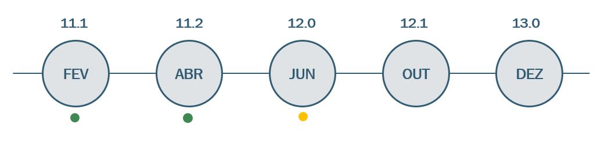

# Elevation FW Releases

Here you can find information about all the Elevation Framework Releases, as well as all published hotfixes.
All release notes include information about the new features, the bugs resolved, and give indications of how the upgrade should be performed.

Elevation FW ships new releases every two months approximately. This releases correspond to major or minor versions.
In addition, whenever necessary, hotfixes are published, corresponding to patch versions.

### Support
Support is guaranteed for the last 3 published versions, which corresponds to approximately 8 months.
It's up to each product team to keep updating the FW. No fixes will be made for unsupported versions.
  

## 2021 Release Plan

## Releases

### **2021**

| date | server version/client tag | semantic jump |
| :---: | :---: | :---: |
| 30 Jun 2021 | [11.2.7.X / hotfix_11.2.7](./11.2.0.X/README.md##hotfix-1127-30-jun-2021)   | _patch_ version |
| 07 Mai 2021 | [11.2.6.X / hotfix_11.2.6](./11.2.0.X/README.md#hotfix-1126-07-jun-2021)    | _patch_ version |
| 02 Mai 2021 | [11.2.5.X / hotfix_11.2.5](./11.2.0.X/README.md#hotfix-1125-02-jun-2021)    | _patch_ version |
| 28 Mai 2021 | [11.2.4.X / hotfix_11.2.4](./11.2.0.X/README.md#hotfix-1124-28-mai-2021)    | _patch_ version |
| 25 Mai 2021 | [11.2.3.X / hotfix_11.2.3](./11.2.0.X/README.md#hotfix-1123-25-mai-2021)    | _patch_ version |
| 24 Mai 2021 | [11.2.2.X / hotfix_11.2.2](./11.2.0.X/README.md#hotfix-1122-24-mai-2021)    | _patch_ version |
| 19 Mai 2021 | [11.2.1.X / hotfix_11.2.1](./11.2.0.X/README.md#hotfix-1121-15-mai-2021)    | _patch_ version |
| **07 Mai 2021** | [11.2.0.X / mainline_11.2.0](./11.2.0.X/README.md)                         | minor version   |
| **12 Fev 2021** | [11.1.0.X / mainline_11.1.0](./11.1.0.X/README.md)                         | minor version   |

### **2020**

| date | server version/client tag | semantic jump |
| :---: | :---: | :---: |
| **07 Dez 2020** | [11.0.0.X / mainline_11.0](./11.0.0.X/README.md)           | **major** version |
| **12 Out 2020** | 10.1.0.X / mainline_10.1.0                                 | minor version |
| **06 Ago 2020** | 10.0.0.X / mainline_10.0                                   | **major** version |
| **28 Jul 2020** | 9.5.0.X / mainline_9.5                                     | minor version |
| **08 Jul 2020** | 9.4.0.X / mainline_9.4                                     | minor version |
| **12 Mai 2020** | 9.1.0.X / mainline_9.1                                     | minor version |
| **24 Abr 2020** | 9.0.1.X / mainline_9.0                                     | **major** version |
| **26 Mar 2020** | 8.4.0.X / mainline_8.4                                     | minor version |
| 04 Fev 2020 | 8.3.1.X / mainline_8.3                                     | _patch_ version |
| **07 Jan 2020** | 8.3.0.X / mainline_8.3                                     | minor version |

### **2019**

| date | server version/client tag | semantic jump |
| :---: | :---: | :---: |
| **27 Nov 2019** | 8.2.0.X / mainline_8.2                                     | minor version |
| 13 Nov 2019 | 8.1.1.X / mainline_8.1                                     | _patch_ version |
| **29 Out 2019** | 8.1.0.X / mainline_8.1                                     | minor version |
| 15 Out 2019 | 8.0.1.X / mainline_8.0                                     | _patch_ version |
| **02 Out 2019** | 8.0.0.X / mainline_8.0                                     | **major** version |
| **05 Ago 2019** | 7.1.0.X / mainline_7.1                                     | minor version |
| 11 Jun 2019 | 7.0.1.X / mainline_7.0                                     | _patch_ version |
| **17 Mai 2019** | 7.0.0.X / mainline_7.0                                     | **major** version |
| **08 Abr 2019** | 6.0.0.X / mainline_6.0                                     | **major** version |
| **15 Mar 2019** | 5.0.0.X / mainline_5.0                                     | **major** version |
| **14 Fev 2019** | 4.2.0.X / mainline_4.2                                     | minor version |
| **25 Jan 2019** | 4.1.0.X / mainline                                         | minor version |
| 08 Jan 2019 | 4.0.8.X / mainline                                         | _patch_ version |
  
